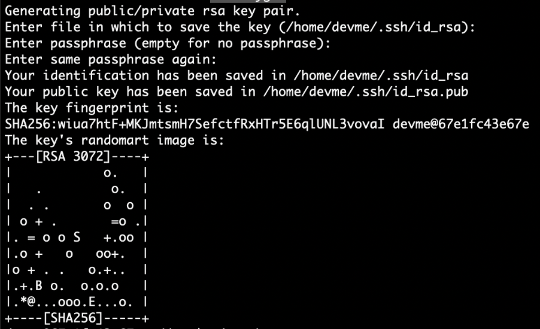
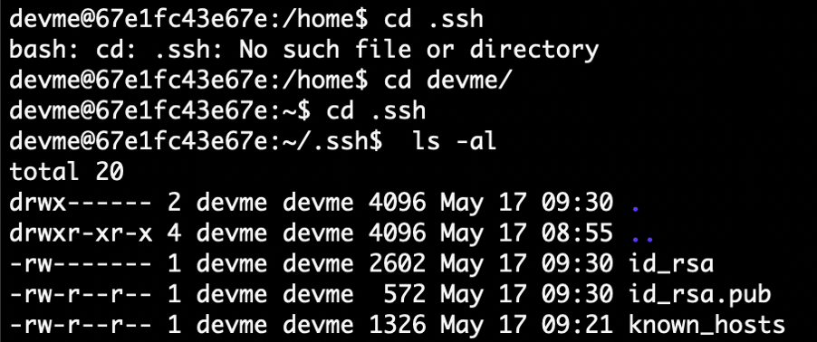
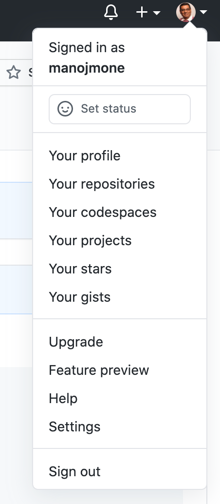
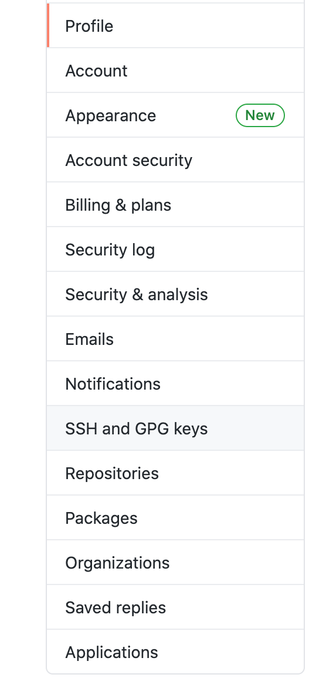
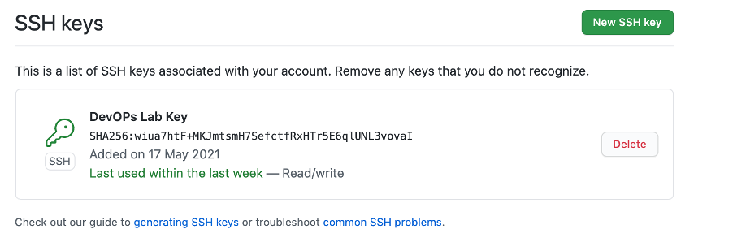
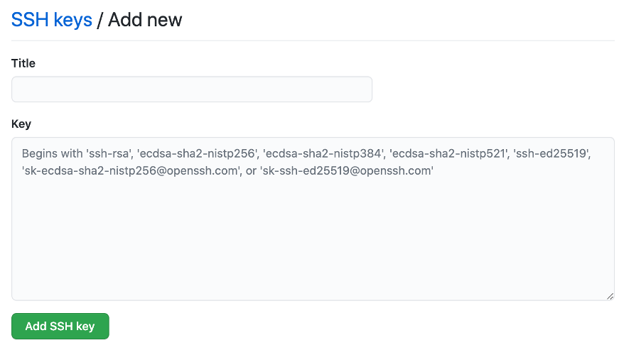
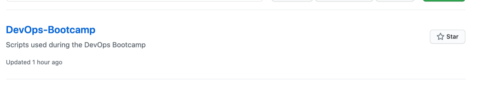
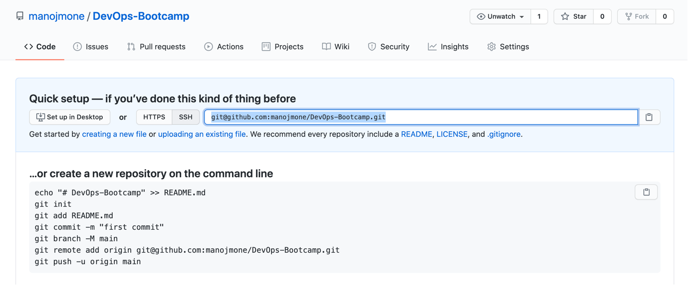
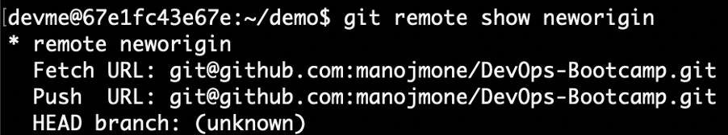

.. _devgit:

.. title:: Setting up Git

++++++++++++++++++++++++++++++++++++++++++
Setting up Git
++++++++++++++++++++++++++++++++++++++++++

Welcome to the first module of the DevOps Bootcamp!

You will create a typical developer workstation and use it to configure access to a Git repository.

.. note::

	Estimated time to complete this lab is 30 minutes

Lab Agenda
+++++++++++

- Setup Developer desktop using Docker
- Configure Git on the developer desktop and remote commit code to Github

Prerequisites
++++++++++++++

- You will need Docker Desktop installed on your computer.
- You can download it from here - https://www.docker.com/products/docker-desktop
- You will need an Github account. Make sure you don't use the enterprise Github.
- If you don't have a Github account, you can create one here - https://github.com/

Getting the Developer workstation ready
++++++++++++++++++++++++++++++++++++++++++
We will be using an Ubuntu instance as our developer workstation. The prerequisite for this step is to ensure that you have docker desktop installed on your computer.

First pull the latest ubuntu image –

.. code-block:: bash

  docker pull ubuntu

Now, use this image to run Ubuntu in a docker container

.. code-block:: bash

  docker run -t -i ubuntu /bin/bash

You will be presented with a root prompt. Your workstation OS is ready!

Working with Github
++++++++++++++++++++

Our developer desktop should be able to publish to a remote repository hosted on  github.com. To ensure this first login to github.com and create a new repository called DevOps-Bootcamp.

Now to ensure we have a seamless and password free access to this repository from our developer computer, Let’s generate our own private and pubic ssh keys.

To do so, use the following command on your developer desktop’s terminal window –

.. code-block:: bash

  ssh-keygen

When asked for paraphrase press the enter key, you will be asked again to confirm it.

You will be shown messages similar to the one below -

Next change directory to to the .ssh folder

.. code-block:: bash

  $ cd .ssh

Next check if your private and public key files have been created –

We will have to copy the public key contents, for this you can use the cat command and then copy the output to clipboard –

.. code-block:: bash

  ~/.ssh$ cat id_rsa.pub

This will display the contents of the public key file. Now copy this output to the clipboard.

Now, in your browser navigate to the window where you have the github.com website open. Click on your profile image (top right corner) and click the settings menu that is displayed –

Next navigate to the SSH and GPG keys menu and click on the button named New SSH key and paste the contents from clipboard. Hive an appropriate name to the new key.

On your Github homepage, click on 'New' and for Repository name enter - DevOps-Bootcamp. You can also add a brief description if you like.
Remember to keep your repository setting to the default value of Public. Click on create repository. Your repository is ready!

You will be shown an empty repository. Click on the code button and copy the ssh address shown in the box. It will always start with git@github.com

Coming back to your Ubuntu terminal, we will create a new devloper user called 'devme'
adduser devme

- Next we will change our terminal session from root to the newly created user devme

.. code-block:: bash

  su devme

- first create a folder named demo

.. code-block:: bash

  mkdir demo

- Next we will initate git in this folder

.. code-block:: bash

  git config --global user.name "devme"

- Check if any remote repository is already associated by running this command –

.. code-block:: bash

  git remote -v

If you receive no output, it means that there is no remote repository associated.

- Back on your terminal, run the following command

.. code-block:: bash

  git remote add neworigin git@github.com:<yourgitid>/DevOps-Bootcamp.git

For example for my repository I will write the command as –

.. code-block:: bash

  git remote add neworigin git@github.com:manojmone/DevOps-Bootcamp.git

This will add a new remote connection named “neworigin” from the developer PC to the remote git repository. You can check the connectivity by giving the following command –

We are all set to push our code to the remote repository. On your terminal navigate to the folder where you have your Java files and run the command

.. code-block:: bash
  git push neworigin master

  .. figure:: images/neworigin_push.png

Working with our code and publishing it to Git
+++++++++++++++++++++++++++++++++++++++++++++++

We will create a simple java code using the vi editor.

- Enter following code

.. code-block:: Java

  class Demo1
  {
  public static void main (String args[])
  {
  System.out.println("Java Demo for DevOps");
  }
  }

- Save the file

- Let's add thsi code to Git

.. code-block:: bash

  git add demo1.java

- Check the status

.. code-block:: bash

  git status

You will be shown a message stating -

On branch master

No commits yet

Changes to be committed:
  (use "git rm --cached <file>..." to unstage)
	new file:   demo1.java

- Now commit the code -

.. code-block:: bash

  git commit

You will now see a vi window, this is for you to enter a commit message. you may enter any text. When you save the file, git will proceed with the commit.
