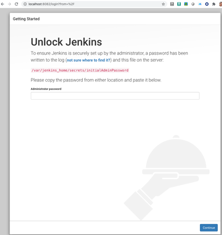
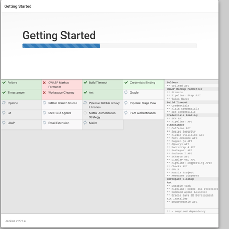
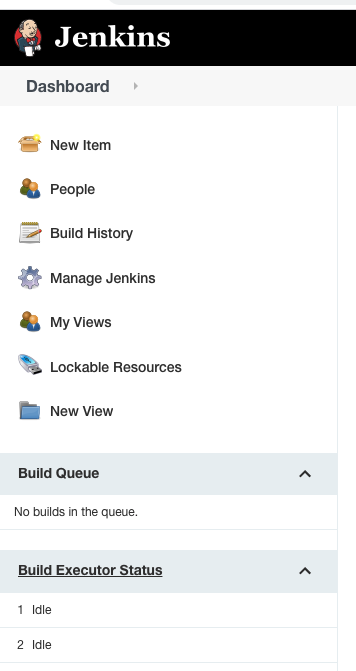
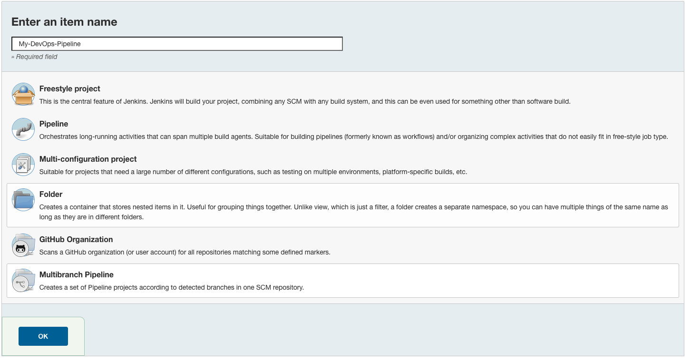
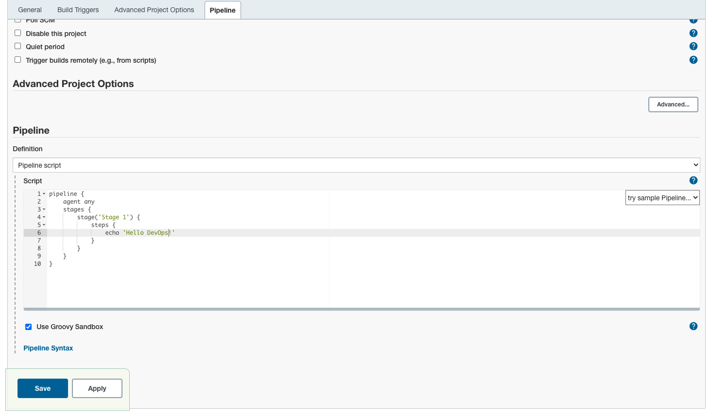
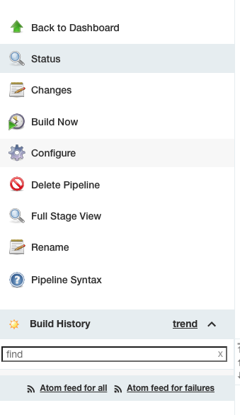
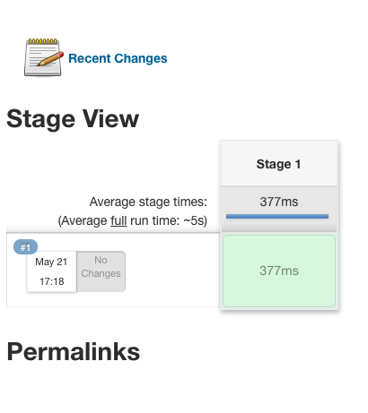
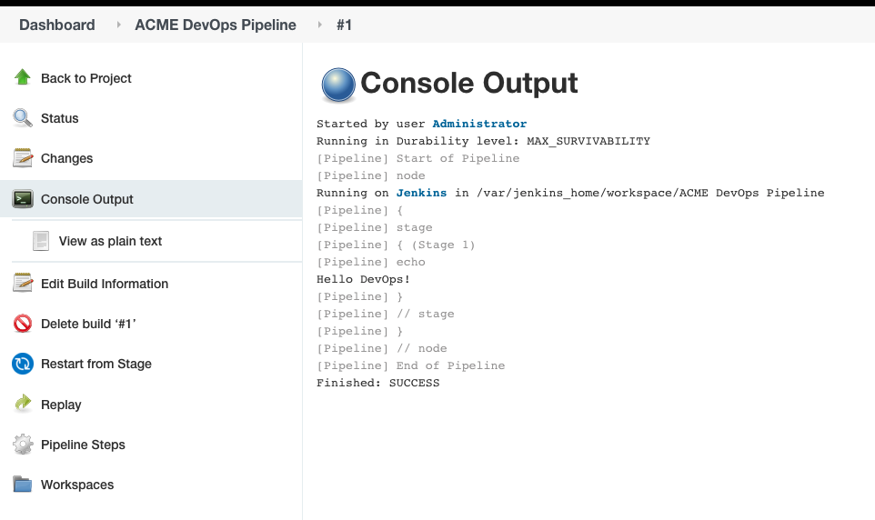

.. _devjenkins:

.. title:: Setting up a Jenkins Pipeline

++++++++++++++++++++++++++++++++++++++++++++++++++++
Setting up a Jenkins Pipeline
++++++++++++++++++++++++++++++++++++++++++++++++++++

Welcome to the second lab of the DevOps Bootcamp! 

In this lab you will install Jenkins and configure a pipeline. 

.. note::

	Estimated time to complete this lab is 60 minutes

Lab Agenda
+++++++++++

- Install Jenkins
- Configure a Pipeline
  

Prerequisites
++++++++++++++

- You will have completed the Lab 1 of this bootcamp
- We will be using the Ubuntu container created in the first lab for the developer workstation

Installing Jenkins
+++++++++++++++++++
We will again use Docker to create a new Jenkins instamce. Before we get started, you’ll need to ensure that you have installed Docker on your machine. 

After installing Docker, download the latest stable Jenkins image by running:

.. code-block:: bash
  
  docker image pull jenkins/jenkins:lts

If you are using Rancher -

.. code-block:: bash
  
  nertdctl image pull jenkins/jenkins:lts

The main benefit of using Docker containers for hosting Jenkins is that you will be able to persist the state of your Jenkins server using Docker volumes. How does that help?
  - You will retain all your projects and configurations even after restarting your computer (local machine)
  - You don't need to run the whole Jenkins setup again
  - You may remove your container instance and still able to recover the state of your Jenkins server

You can create a volume by running the command below:

.. code-block:: bash
  
  docker volume create [YOUR VOLUME]

For example, if you wish to name your docker volume name as jenkinsvol:

docker volume create jenkinsvol

If you are using Rancher -

.. code-block:: bash
  
  nertdctl volume create jenkinsvol

Run the container by attaching the volume and assigning the targeted port. In this example, we'll also run it in detached mode. Here is the command to run your Docker container:

.. code-block:: bash
  
  docker container run -d \
    -p [YOUR PORT]:8080 \
    -v [YOUR VOLUME]:/var/jenkins_home \
    --name jenkins-local \
    jenkins/jenkins:lts

.. code-block:: bash
  
  nerdctl container run -d \
    -p [YOUR PORT]:8080 \
    -v [YOUR VOLUME]:/var/jenkins_home \
    --name jenkins-local \
    jenkins/jenkins:lts

Here is what each argument means:
  -d: detached mode
  -v: attach volume
  -p: assign port target
  —name: name of the container

For example, the command below will create a new container named jenkins-local that uses docker volume named jenkinsvol.

.. code-block:: bash
  
  docker container run -d -p 8082:8080 \
    -v jenkinsvol:/var/jenkins_home \
    --name jenkins-local \
    jenkins/jenkins:lts

For Rancher, replace the word docker with nerdctl -

.. code-block:: bash
  
  nerdctl container run -d -p 8082:8080 \
    -v jenkinsvol:/var/jenkins_home \
    --name jenkins-local \
    jenkins/jenkins:lts

If you were to run the docker ps or nerdctl ps (in case of rancher) command now, you should see two containers one would be the ubuntu container created in lab 1 and second will be the jenkins container.

Now that we know that our container is running, we will use the browser to access our Jenkins instance.

Now open your web browser and type this in the url box -

.. code-block:: bash
  
    http://localhost:8082/

localhost:[YOUR PORT] (localhost:8082 based on my docker container run example above). You may replace 8082 to the port of your choice in the earlier command and use the same in the browser as well.

You will be shown a scree like the one below -

So where's this password? As a part of the Jenkins setup, the password is kept inside the container instance. In order to do this, we need to use the CONTAINER ID (or the name) and run docker exec.

Here is the full command to access it -

.. code-block:: bash
  
    docker container exec \
    [CONTAINER ID or NAME] \
    sh -c "cat /var/jenkins_home/secrets/initialAdminPassword"

So, to find the password for my container named jenkins-local, the command will be:

.. code-block:: bash
  
    docker container exec \
    jenkins-local \
    sh -c "cat /var/jenkins_home/secrets/initialAdminPassword"

In case of Rancher -

.. code-block:: bash
  
    nerdctl container exec \
    jenkins-local \
    sh -c "cat /var/jenkins_home/secrets/initialAdminPassword"

You will be shown an alpha-numeric code as an output, Copy the code and paste it on the webpage to unlock Jenkins. 
After unlocking, click on Install suggested plugins tile on the Customize Jenkins page. 

Wait until the installation of suggested plugins is complete and then you can proceed in creating your first admin user.
After creating the admin user, setup the Instance configuration. Since you are only using Jenkins locally, leave the URL to your localhost URL. 
Click on Save and Finish to start using Jenkins.

Creating your first pipeline
+++++++++++++++++++++++++++++

Jenkins Pipeline (or simply put "Pipeline") is a set of plugins which can be leveraged to implement and integrate continuous delivery pipelines into Jenkins.

- Navigate to the Jenkins dashboard and from the left menu, click on the menu named New Items

- Provide a name for your new item (e.g. My-DevOps-Pipeline) and select Pipeline and click on OK
  

- Click the Pipeline tab at the top of the page to scroll down to the Pipeline section. In the Pipeline section, ensure that the Definition field indicates the Pipeline script option.
- Enter your Pipeline code into the Script text area.

.. code-block:: bash 

  pipeline {
    agent any 
    stages {
        stage('Stage 1') {
            steps {
                echo 'Hello DevOps!' 
            }
        }
    }
  }

- Click the Save button, this will take you to the Pipline view
  

- On this page, click Build Now on the left to run the Pipeline.

- You will be shown a Stage View detailing the progress of the build.

- Notice the section called "Build History" at the bottom of the left menu pane. We can view the details of the builds in this pane. For now you will see only one record #1.
- Click on #1 to view the status. On the left menu click on Console Outputto view output of this build's pipeline run. 

Your first pipeline is up and running!

