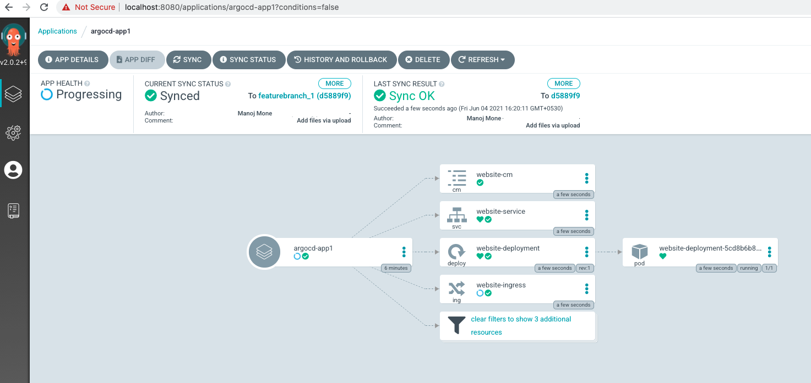

.. _gitops:

.. title:: GitOps on a Laptop

++++++++++++++++++++++++++++++++++++++++++
GitOps on a Laptop
++++++++++++++++++++++++++++++++++++++++++

Welcome to the third lab of the DevOps Bootcamp!

You will create a typical developer workstation and use it to configure access to a Git repository.

.. note::

	Estimated time to complete this lab is 60 minutes

Lab Agenda
+++++++++++

- Configure minikube on the developer desktop

Prerequisites
++++++++++++++

- You will need Docker Desktop installed on your computer.
- You can download it from here - https://www.docker.com/products/docker-desktop
- You will need an Github account. Make sure you don't use the enterprise Github.
- If you don't have a Github account, you can create one here - https://github.com/

Setup a local cluster with Minikube
++++++++++++++++++++++++++++++++++++

Minikube is an open-source tool which provides you with a one-node cluster where both master processes and worker processes run inside that node. You can easily install Minikube on your computer and test your application using it. Minikube provides you pre-installed Docker as your container runtime so that you don’t need to install Docker separately.

We will be using our Laptop Macbookas our host for the Kubernetes cluster. The prerequisite for this step is to ensure that you have docker desktop installed on your computer.

On your terminal window, follow these steps to install minikube -
The instructions in this lab assume you are using a Macbook. If you are using Windows, follow these steps for the installation of minikube -

Download and run the stand-alone minikube Windows installer available here - https://storage.googleapis.com/minikube/releases/latest/minikube-installer.exe

For Mac -

Install Homebrew -

.. code-block:: bash

 $ /usr/bin/ruby -e "$(curl -fsSL https://raw.githubusercontent.com/Homebrew/install/master/install)"

To install minikube on x86-64 Linux using binary download:

.. code-block:: bash

   curl -LO https://storage.googleapis.com/minikube/releases/latest/minikube-linux-amd64

.. code-block:: bash

  sudo install minikube-linux-amd64 /usr/local/bin/minikube

For a Mac, follow these steps -

We will be using Homebrew package manager. If you don't have it alreay installed on your mac, you can install it by running thi scommand in your terminal - 

.. code-block:: bash

  curl -fsSL https://raw.githubusercontent.com/Homebrew/install/HEAD/install.sh

Update Homebrew - 

.. code-block:: bash

  $ brew update

Once you’re done with Homebrew, you will have to select a virtual machine manager to install Minikube.
Hyperkit is what we will use for this lab as it is easy to install with Homebrew. To install Hyperkit, run the below command on your terminal.

.. code-block:: bash

  brew install hyperkit

To install Minikube run the below command on your terminal.

.. code-block:: bash

  $ brew install minikube

  $ curl -LO https://storage.googleapis.com/minikube/releases/latest/minikube-darwin-amd64

  $ sudo install minikube-darwin-amd64 /usr/local/bin/minikube

We verify the setup is correct by running minikube command:

.. code-block:: bash

  $ minikube start --vm-driver=hyperkit

This command may take some time to complete. 

Now we’re almost done with the minikube installation. Next, you can try out different kubectl commands to get outputs. 
Run the below command to get your nodes inside the cluster.

.. code-block:: bash

  kubectl get nodes

Installing ArgoCD
+++++++++++++++++++

Argo CD is a declarative, continuous delivery tool for Kubernetes based on the GitOps approach.

We begin our Argo CD installation by creating a new namespace -

.. code-block:: bash

  kubectl create namespace argocd

Run kubectl get ns command on your terminal and you’ll see a new namespace has been created inside your cluster. 
Then we can install Argo CD into that namespace using the command below [make sure to use the exact command].

.. code-block:: bash

  kubectl apply -n argocd -f https://raw.githubusercontent.com/argoproj/argo-cd/stable/manifests/install.yaml

This command will start creating all the required resources inside the namespace argocd. This takes some time to complete, so wait till the cursor returns to the prompt.

Accessing Argo CD Server
+++++++++++++++++++++++++

We are all set to access the Argo CD portal. We will use the port forwarding method fo this.

.. code-block:: bash
  
    $ kubectl port-forward svc/argocd-server -n argocd 8080:443

This will start the posrt forwarding session and make the Argo CD portal accessible over the browser. Keep this terminal window open (you may minimize it but don't terminate it). 

Open your browser window and navigate to the url -

.. code-block:: bash

  http://localhost:8080

The default user for the portal is admin and the default admin password is stored in argocd-initial-admin-secret. 

You can retrive this password by using the command in a new terminal window -

.. code-block:: bash

  kubectl -n argocd get secret argocd-initial-admin-secret -o jsonpath="{.data.password}" | base64 -d && echo

Copy the output and paste in the password box.

You are now all set to use Argo CD

Sample application
+++++++++++++++++++

Let's build a sample application that deploys a Nginx server and hosts some content. As always for any new application in Kubernetes, begin by creating a new namespace -

.. code-block:: bash

  $ kubectl create namespace dev

For our lab, we will be hosting our ArgoCD stuff in a dedicate prject called - argocd-project1. We have set it to work with only in-cluster deployments within the dev namespace.
The repository is restricted to my github repository named manojmone, you may want to change it to your own github repository.

Here's the project.yaml file for our project -

.. code-block:: bash

  cat > project.yaml << EOF 
  apiVersion: argoproj.io/v1alpha1
  kind: AppProject
  metadata:
  name: argocdrocks-project
  labels:
    app: argocdrocks
  spec:
    # Project description
    description: Our ArgoCD Project to deploy our app locally
    # Allow manifests to deploy only from my git repositories 
    sourceRepos:
    - "https://github.com/manojmone/*"
    # Only permit to deploy applications in the same cluster
    destinations:
    - namespace: dev
      server: https://kubernetes.default.svc
    # Enables namespace orphaned resource monitoring.
    orphanedResources:
      warn: false
  EOF

Let's apply this file -

.. code-block:: bash

  $ kubectl apply -f project.yaml -n argocd

You will get a confirmation on the terminal window stating - "appproject.argoproj.io/argocd-project1 created"

The /app folder in our repository has to synchronize our Kubernetes manifest. This will be done by a ArgoCD Application.  
The app folder will be hosted on our github repository feature branch featurebranch_1 with the associated resources inside the dev namespace on our local cluster:

.. code-block:: bash

  cat > application.yaml << EOF 
  apiVersion: argoproj.io/v1alpha1
  kind: Application
  metadata:
    labels:
      app: argocd
    name: argocd-app1
  spec:
    project: argocd-project1
    source:
      repoURL: https://github.com/manojmone/argocd-projects.git
      targetRevision: featurebranch_1
      path: app
      directory:
      recurse: true
    destination:
      server: https://kubernetes.default.svc
      namespace: dev
  syncPolicy:
    automated:
      prune: false
      selfHeal: true
  EOF

Next Apply this file -

.. code-block:: bash

  kubectl apply -f application.yaml -n argocd

The effect of synchronization is almost immediate! Switch to your browser screen running Argo CD and here's what you will see -

